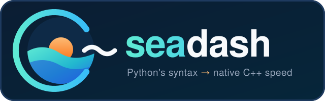

<p align="center">
  
</p>

<p align="center"><b>C++ with the simplicity of Python.</b></p>

---

**seadash** is a programming language that looks like Python and runs like C++. You write
code with Python's syntax: indentation, slicing, f-strings, list comprehensions,
`import base64`. The compiler type-checks the whole program and translates it into C++23,
and a C++ compiler builds a native binary.

- **Familiar:** most small Python programs are valid seadash, and many of the test programs run unchanged under `python3`.
- **Checked:** types are inferred and checked before anything runs. `None` can't sneak into a `str`, and threads can't race on shared data.
- **Fast:** no interpreter and no GIL. Typical programs run 7–70x faster than CPython.
- **Small:** the compiler is plain Python, and the runtime is a header-only C++ library.

```python
from collections import Counter
from dataclasses import dataclass


@dataclass
class Book:
    title: str
    words: list[str]

    @property
    def longest(self) -> str:
        return max(self.words, key=len)


def find(books: list[Book], title: str) -> Book | None:
    for b in books:
        if b.title == title:
            return b
    return None


books = [
    Book("sea", "the sea the sea is calm".split()),
    Book("dash", "dash off a quick note".split()),
]
counts = Counter(w for b in books for w in b.words)
print(counts.most_common(2))

book = find(books, "dash")
if book is not None:  # book is Book? until checked
    print(f"{book.title}: {len(book.words)} words, longest is {repr(book.longest)}")
```

```console
$ sd run books.sd
[('the', 2), ('sea', 2)]
dash: 5 words, longest is 'quick'
```

This program is also valid Python, and `python3 books.sd` prints the same thing.

## Why

Python is a joy to write and often too slow to run. C++ is fast, but its templates,
standard-library spelling and `reinterpret_cast`s get in the way. seadash keeps the
Python you write and gives you the C++ you'd want underneath.

`bench/run.py` checks that both produce identical output, then times them (best of 3):

| benchmark | python3 | seadash | speedup |
|---|---:|---:|---:|
| `lists_dicts`: building and querying lists and dicts | 2.08s | 0.28s | **7.5x** |
| `objects`: classes, virtual methods, floats, recursion | 2.51s | 0.03s | **73x** |
| `threads`: parallel CPU work, queues, locks | 7.45s | 0.21s | **35x** |
| `hashing`: hashlib/hmac on small messages, bulk data, pbkdf2 | 1.22s | 0.90s | 1.4x |
| `sockets`: localhost TCP round trips, bulk transfer, connections | 2.00s | 1.74s | 1.2x |

The threads benchmark shows what real parallelism looks like: on CPython, 8 threads take
exactly as long as 1. The last two are honest about where seadash can't help much: most
of their time is spent in OpenSSL and in the kernel, the same code for both languages.

## Getting started

You need:

- **Python 3.12+**, to run the compiler.
- **A C++23 compiler:** g++ 14 or newer. Set `SEADASH_CXX` to pick a specific one.
- **zlib, PCRE2 and OpenSSL** development headers, for the `zlib`, `re`/`textwrap` and `hashlib` modules (`apt install zlib1g-dev libpcre2-dev libssl-dev`).

```console
$ python3 -m venv .venv && .venv/bin/pip install -e .
$ .venv/bin/sd run books.sd     # the example above
```

| command | what it does |
|---|---|
| `sd run FILE [ARGS...]` | build to a temporary binary and run it |
| `sd build FILE [-o NAME]` | compile to a native binary (`--debug` for a faster, unoptimized build) |
| `sd check FILE` | type-check, and list every variable's inferred type |
| `sd emit FILE` | print the generated C++ |
| `sd tokens` / `sd ast` | debugging views of the lexer and parser |
| `sd clean` | empty the build cache |

Builds are cached (in `~/.cache/seadash`): running a program you haven't changed skips the
C++ compiler entirely, and the runtime header is precompiled once, so small edits rebuild
quickly. `--no-cache` always compiles.

`sd run` with no file (or `-`) reads the program from stdin:

```console
$ echo 'print(sum(x * x for x in range(10)))' | sd run
285
```

## The language in a nutshell

**Types are inferred, and names can be rebound to a new type.** Each type gets its own C++ variable.

```python
a = 2
a = str(a)          # fine: a is now a str
total: float = 0    # annotate when you want to
```

**`struct` is a value, `class` is a shared reference.** Lists, dicts and sets are values too.

```python
struct Point:
    x: int
    y: int

class Counter:
    n: int
    def bump(self):
        self.n += 1

p = Point(1, 2)
q = p          # a copy: changing q.x leaves p alone
c = Counter(0)
d = c          # the same object: d.bump() changes c.n
```

**None-safety.** `T?` (or `T | None`) is "T or None", and the checker makes you handle the `None` case. Checks narrow the type, including checks on attributes and `isinstance`.

```python
def find(xs: list[str], target: str) -> int?:
    ...
if (i := find(names, "bob")) is not None:
    print(names[i])        # i is an int here
```

**Also supported:**
- **Functions:** generics (`def first[T](xs: list[T]) -> T | None`, `class Stack[T]:`), closures that share variables like Python's, lambdas, and functions as values.
- **Generators:** `yield` and `yield from` (in functions and methods, including `__iter__`), `next()`, and `iter()`; they're C++20 coroutines, so values are made on demand, even from infinite generators. Generator expressions, `map`, `filter`, `zip` and `enumerate` are lazy too.
- **Error handling:** exceptions (`try`/`except`/`finally`/`raise`, custom exception classes), and `with` statements.
- **Classes:** inheritance and dunder methods (`__add__`, `__eq__`, `__lt__`, `__hash__`, `__getitem__`, `__iter__`, `__str__`...).
- **Decorators:** `@dataclass`, `@property`, `@staticmethod`, `@classmethod`, `@functools.cache`, and your own decorators.
- **Modules:** `import` of your own `.sd` files and packages.

**Threads without a GIL, checked for data races.** Threads are real OS threads running in
parallel. The checker only lets them share values that are copied, or thread-safe
objects (`Lock`, `queue.Queue`, `threading.Mutex[T]`, `threading.Atomic`, and
`threading.Synchronized` classes):

```python
total = 0
def work():
    global total
    total += 1   # error: thread code uses the module-level 'total' (int), but it's
                 # modified. Threads can't share it safely: wrap it in a threading.Mutex,
                 # send data through a queue.Queue, or pass a copy in args=
```

## Standard library

| module | notes |
|---|---|
| `base64`, `zlib` | encode, decode, compress |
| `json` | typed: `json.loads` straight into your dataclasses, lists and dicts; `json.Value` for dynamic JSON |
| `os`, `os.path` | files, directories, environment |
| `sys` | `argv`, `exit` |
| `time`, `math`, `random` | the usual |
| `socket` | TCP/UDP with Python's API and errors |
| `threading`, `queue` | threads, locks, events, queues; plus seadash's `Mutex[T]`, `Atomic` and `Synchronized` |
| `concurrent.futures` | `ThreadPoolExecutor` (`submit`, `map`, `shutdown`, `with`), `Future`, `as_completed`, `wait`; work on the pool is checked for data races like threads are |
| `itertools` | all of it, lazily: `count`, `cycle`, `repeat`, `accumulate`, `chain`, `groupby`, `islice`, `tee`, `zip_longest`, `product`, `permutations`, `combinations`, `pairwise`, `batched`... (`permutations(xs, 2)` gives `tuple[T, T]`) |
| `hashlib`, `hmac` | every guaranteed algorithm (md5, sha1/2/3, blake2, shake) on OpenSSL, `pbkdf2_hmac`, `file_digest`; `hmac.new`, `hmac.digest`, `compare_digest` |
| `string` | the character-set constants, `capwords`, and `Template` (`$name` / `${name}` with `substitute` and `safe_substitute`) |
| `textwrap` | `wrap`, `fill`, `shorten`, `dedent`, `indent`, `TextWrapper`: a port of Python's algorithm (hyphens, em-dashes, `max_lines`), so lines break where Python's do |
| `collections` | `defaultdict`, `Counter`, `deque` |
| `re` | Python's regular expressions on PCRE2; literal patterns are checked at compile time, and `m.group(1)` is a `str` when the group always matches |
| `subprocess` | `run`, `check_output`, `call`, `Popen` (streaming, `communicate`, timeouts); `r.stdout` is `str` or `bytes` depending on `text=`, and reading an uncaptured stream is a compile error |
| `pathlib` | `Path` values: `/` joins, `name`/`stem`/`suffix`/`parent`, `read_text`/`write_text`, `mkdir`, `iterdir`, `glob`/`rglob`, `resolve`...; `open()` takes a `Path` too |
| `shutil`, `tempfile` | `copy`/`copy2`/`copytree`, `move`, `rmtree`, `which`, `disk_usage`; `TemporaryDirectory` (removes itself), `mkdtemp`, `gettempdir` |
| `datetime`, `zoneinfo` | `date`, `time`, `datetime`, `timedelta`, `timezone`, and named zones like `ZoneInfo("Europe/Paris")` (daylight saving time included): arithmetic, `strftime`/`strptime`, `isoformat`/`fromisoformat`, `now()`/`today()`, time zone conversion |
| `argparse` | `ArgumentParser` with Python's help and errors, and subcommands; the parsed arguments are typed from `add_argument()` (`args.count` is an `int`, a misspelled `args.cuont` is a compile error, and inside `if args.command == "add":` the add subcommand's arguments have their real types) |
| `dataclasses`, `functools` | `@dataclass`, `field()`, `@cache`, `@lru_cache` |
| `typing` | `Callable`, `Optional`, `Iterator`... (so the same code also runs under Python) |


## Differences from Python

seadash borrows Python's syntax, not all of its semantics:

- **Lists, dicts and sets are values.** Assigning or passing one makes a copy, so a function that appends to its list parameter changes its own copy, not yours. Use a `class` when you want sharing.
- **Static types.** Containers hold one type (`list[int]`, not a mix), and there's no dynamic typing or `eval`. Mixed numbers widen, so `[1, 2.5]` is a `list[float]`.
- **Generators** don't support `send()`/`throw()`, and nested functions can't be generators yet. (Generators, generator expressions, `map`, `filter`, `zip` and `enumerate` are all lazy, as in Python.)
- **Strings are UTF-8 bytes.** Indexes and lengths count bytes.
- **Not supported yet:** a few dynamic features, such as `type(x)`, `**kwargs`, unions other than `T | None`, and multiple inheritance.

## How it works

```
source.sd → lexer → parser → type checker → C++23 codegen → g++ → native binary
                                   │
                      (flow-sensitive: narrowing, rebinding,
                       None-safety, thread-safety analysis)
```

| path | what's there |
|---|---|
| `seadash/lexer.py`, `parser.py`, `ast.py` | Python-style syntax, `INDENT`/`DEDENT` tokens |
| `seadash/checker.py`, `types.py`, `builtins.py` | type inference and checking; built-in functions and modules |
| `seadash/threads.py` | which values threads may share |
| `seadash/codegen.py` | C++ generation |
| `seadash/runtime/` | the header-only runtime (`seadash.hpp`, plus `modules/*.hpp`) |
| `tests/programs/` | end-to-end programs with expected output (most also run under `python3`) |
| `bench/` | benchmarks against CPython |

## Tests

```console
$ .venv/bin/python -m pytest -q tests/
$ .venv/bin/python bench/run.py
```

---

<sub>The name is a nod to two kids, and it sounds like *C-dash*.</sub>
